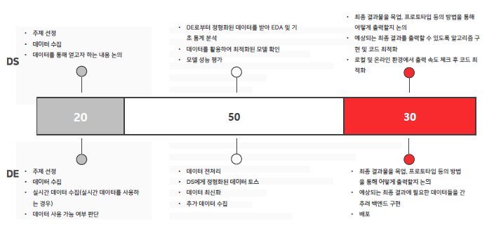
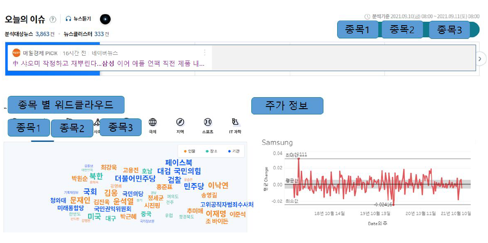

# 미디어 매체 키워드 분석을 통한 주식 시장 동향 파악

- 주제 : **뉴스 매체와 유튜버의 주식가격 등락 예측 정확도 분석**

- 목적 : **미디어 키워드 분석으로 업종별 이슈가 한국 주식에 미치는 영향을 파악하고, 유튜브 스크립트 감성분석을 통해 해당 업종의 등락예측 정확도를 파악, 웹페이지 대시보드로 구현 및 서비스**

- 기간 : 8/25 ~ 10/8

- 멘토링 일정 : 8/28, 9/11, 10/4

- 중간 발표 : 9/11

- 최종 발표: 10/8
  - 나머지 일정 WBS 참조

- DS - DE 역할 분담

- data : youtube, 뉴스 기사 크롤링, FinanceDataReader( 한국거래소 자료)

- 개요 :

- > 1. 데이터 수집
  >
  >    1.  크롤링으로 유튜브 스크립트, 언론 보도 이슈 수집
  >
  >       - 유튜브의 경우 ( 구독자수 기준 ) : 금융 유튜브 채널 상위 4개
  >
  >       - 언론보도 자료 ( 유료부수 구독자 수 기준 ) : 매일경제, 머니투데이     
  >
  >       - 매일 업로드 되는 자료에 대한 스크립트 추출 예정
  >
  >         - 크롤링 : 헤드라인, 자막, 말, 스크립트
  >
  >           \- 슈카월드
  >
  >           \- 삼프로TV
  >
  >           \- 키움증권 채널K
  >
  >           \- 삼성증권 Samsung POP
  >
  >           \- (미래에셋 스마트머니)
  >
  >    2. FinanceDataReader 라이브러리로 주식가격 데이터 수집 ( 한국거래소  자료 ) 
  >
  >       - 매일 실시간 종가 데이터 수집      
  >       - 추후 업종 및 종목을 선택 예정
  >
  > 2. 데이터 전처리
  >
  >    1. 유튜브 스크립트 & 언론 보도 이슈   
  >       - 텍스트 마이닝
  >    2. 주식가격
  >       - 종목마다의 가격 차이를 고려하여 MinMaxScaler 적용
  >
  > 3.  데이터 분석
  >
  >    1. 유튜브 스크립트 & 언론 보도 이슈      
  >       - 주가 등락 예측을 위한 감성 분석(목적성)
  >
  >    2. 주식 가격     
  >       -   LSTM으로 주식 가격 시계열 예측(분석 방법 비교) 
  >    3. Label
  >       - ①+② 분석을 종합하여 주식가격의 상승/정체/하락 예측
  >
  > 4. 데이터 시각화
  >
  >    1. 일별 이슈 키워드를 나타낸 워드 클라우드로   
  >    2. 키워드 간의 연관성(긍정/부정)   
  >    3. 주가의 시계열 그래프 
  >
  > 5. 웹 페이지 구현
  >
  >    1. 이슈로 예측한 주식가격 예측 결과를 한 눈에 볼 수 있도록 웹 페이지 구현   
  >    2. 해당 회사의 주식 그래프(전날 종가) 및 예측 등락   
  >    3. 유튜브 이슈 워드 클라우드   
  >    4. 보도 이슈 워드 클라우드  

- 최종 목표 웹페이지 구성

- 참고자료
  - LSTM : 
    - https://bziwnsizd.tistory.com/33
    - https://teddylee777.github.io/tensorflow/lstm-stock-forecast
  - 강화학습 : https://github.com/ZeroStrength/RL_tradingbot
  - 시계열 ML : 
    - https://byeongkijeong.github.io/ARIMA-with-Python/
    - https://dinonotes.com/archives/2476
    - https://dacon.io/codeshare/2570
  
