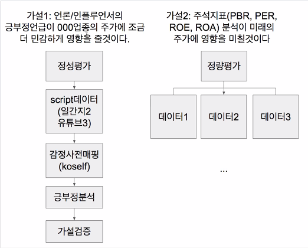
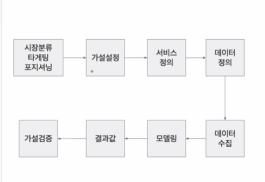

피드백

- 왜 이 기술을 선택했는지?
  - 기획안 정리

왜?

삼성전자, 현대차 주식투자자들 위한 

연관어 분석 nlg , bert 엔진 mrc

Knowledge Graph 기반의 Complex QA 기술

https://www.slideshare.net/NUGU_developers/a1-knowledge-graph-complex-qa?qid=a2837a03-b490-4617-978e-d04cb7109b4d&v=&b=&from_search=1

기업기술 로드맵

http://smroadmap.smtech.go.kr/#none

nlu

https://blog.lgcns.com/1672?category=515093

문장 요약_알고리즘

https://lovit.github.io/nlp/2019/04/30/textrank/

자연어 처리_유사도 측정

https://m.blog.naver.com/sohyunst/221680789442

챗봇_개발 해보기 전 간단한 알고리즘 확인

https://www.slideshare.net/deepseaswjh/ss-132099539

자연어 처리 입문

https://wikidocs.net/book/2155

